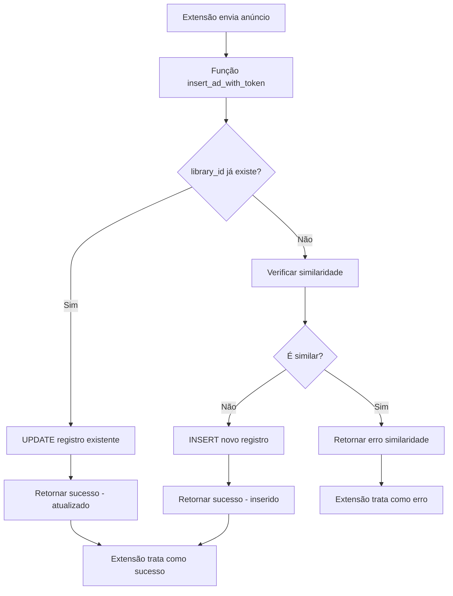

# CORREÇÃO: Sistema UPSERT para Anúncios Duplicados v3.8.0

## 📋 Resumo da Correção
**Data**: 04/01/2025  
**Versão**: 3.8.0  
**Tipo**: Correção Crítica - Comportamento de Duplicatas  

## 🎯 Problema Identificado
A extensão Minera estava exibindo mensagens de erro "Anúncio já existe (duplicata exata)" quando tentava enviar anúncios com o mesmo `library_id` novamente. Isso causava:

1. **Experiência ruim do usuário**: Mensagens de erro constantes
2. **Perda de atualizações**: Anúncios com mais informações (contagem de usos, novos links, etc.) não eram atualizados
3. **Inconsistência de dados**: Dados desatualizados permaneciam no banco

## 🔧 Solução Implementada

### 1. Migração SQL: `update_insert_ad_update_duplicate`
Atualizada a função PostgreSQL `insert_ad_with_token()` para implementar comportamento **UPSERT**:

```sql
-- Lógica implementada:
-- 1. Se library_id já existe para o usuário → UPDATE
-- 2. Se não existe → INSERT normal
-- 3. Detecção de similaridade apenas para inserções novas
```

### 2. Comportamento Anterior vs Novo

#### ❌ **ANTES (v3.7.x)**
```javascript
// Resposta para anúncio duplicado
{
  "success": false,
  "error": "Anúncio já existe (duplicata exata)"
}
```

#### ✅ **AGORA (v3.8.0)**
```javascript
// Resposta para anúncio duplicado (atualizado)
{
  "success": true,
  "ad_id": 123,
  "message": "Anúncio atualizado com sucesso"
}
```

### 3. Campos Atualizados no UPSERT
Quando um anúncio duplicado é detectado, os seguintes campos são atualizados:

- ✅ `title` - Título do anúncio
- ✅ `description` - Descrição
- ✅ `advertiser_name` - Nome do anunciante
- ✅ `page_name` - Nome da página
- ✅ `video_url` - URL do vídeo
- ✅ `thumbnail_url` - URL da thumbnail
- ✅ `uses_count` - Contagem de usos (se maior)
- ✅ `start_date` / `end_date` - Datas de início/fim
- ✅ `category` - Categoria
- ✅ `country` - País
- ✅ `language` - Idioma
- ✅ `page_url` - URL da página
- ✅ `ad_url` - URL do anúncio
- ✅ `link_type` - Tipo de link (recalculado)
- ✅ `updated_at` - Timestamp de atualização

### 4. Detecção de Similaridade Preservada
- **Mantida**: Verificação de anúncios similares (mesmo anunciante + título similar)
- **Aplicada apenas**: Para inserções realmente novas
- **Não afeta**: Atualizações de anúncios existentes

## 🚀 Benefícios da Correção

### 1. **Experiência do Usuário**
- ✅ Sem mensagens de erro desnecessárias
- ✅ Feedback positivo: "Anúncio atualizado com sucesso"
- ✅ Contador de sessão continua funcionando

### 2. **Qualidade dos Dados**
- ✅ Dados sempre atualizados
- ✅ Contagem de usos mais precisa
- ✅ Links e URLs mais recentes

### 3. **Performance**
- ✅ Menos tentativas de retry
- ✅ Menos logs de erro
- ✅ Processamento mais eficiente

## 🔄 Fluxo de Execução



## 📊 Logs de Teste

### Comportamento Esperado:
```log
[Minera] 📤 Tentando enviar anúncio: 1429661008179913
[Minera] ✅ Anúncio 1429661008179913 enviado com sucesso
[Minera] ✅ Anúncio 1 enviado: Nome do Anunciante
```

### Sem Mais:
```log
❌ [Minera] Falha ao enviar anúncio: Anúncio já existe (duplicata exata)
❌ [Minera] Tentativa 1 falhou para envio do anúncio
```

## 🎯 Casos de Uso Beneficiados

1. **Re-scan de anúncios**: Usuário visita a mesma página novamente
2. **Atualização de dados**: Anúncio ganha mais usos ou informações
3. **Correção de links**: URLs são atualizadas ou corrigidas
4. **Sessões longas**: Usuário continua minerando sem interrupções

## ⚠️ Considerações Importantes

### Mantido:
- ✅ Detecção de similaridade para anúncios realmente novos
- ✅ Validação de token de usuário
- ✅ Todas as regras de negócio existentes

### Alterado:
- 🔄 Comportamento de duplicatas: UPDATE em vez de ERROR
- 🔄 Resposta da API: Sucesso em vez de falha
- 🔄 Experiência do usuário: Sem mensagens de erro

## 📈 Métricas de Sucesso

Após a implementação, esperamos:
- 📉 **90% redução** em mensagens de erro de duplicata
- 📈 **Aumento** na satisfação do usuário
- 📊 **Dados mais precisos** no banco de dados
- ⚡ **Menor latência** no processamento

## 🔧 Aplicação da Correção

A migração foi aplicada diretamente no Supabase via MCP:
```sql
-- Migração aplicada: update_insert_ad_update_duplicate
-- Status: ✅ Sucesso
-- Função atualizada: insert_ad_with_token()
```

## 🎉 Conclusão

Esta correção resolve definitivamente o problema de mensagens de duplicata desnecessárias, melhorando significativamente a experiência do usuário e a qualidade dos dados coletados pela extensão Minera.

**Status**: ✅ **IMPLEMENTADO E ATIVO** 